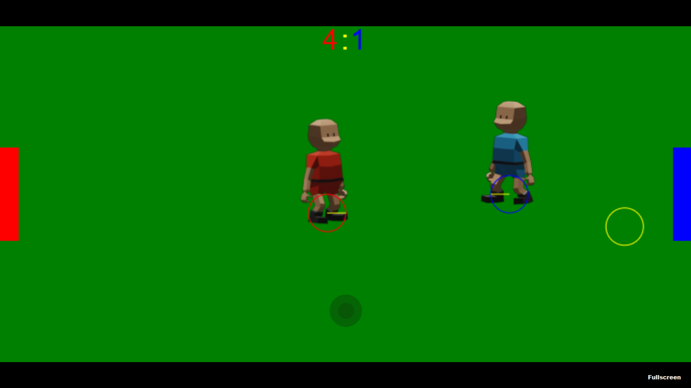
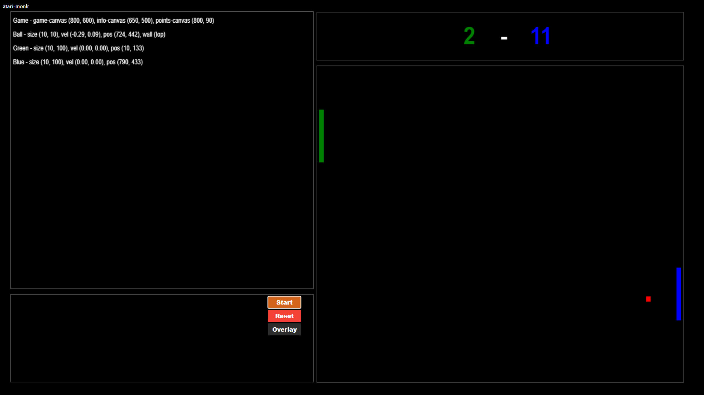

# Atari Monk (Krzysztof Mazanek) **Portfolio**

Welcome to my portfolio! Explore my projects and tutorials that showcase my journey and expertise in software and game development.

---

## My Projects

### **Project 1: Multiplayer Play Ball**

**Overview**:  
A browser-based, two-player multiplayer game that emphasizes fun and simplicity. Fully optimized for mobile devices.

**Technologies**:

-   HTML
-   CSS
-   TypeScript
-   Node.js (Express)

**Features**:

-   Seamless two-player functionality.
-   Mobile-friendly interface for enhanced accessibility.

[Explore the Project](https://polite-bush-063bc3b03.3.azurestaticapps.net/)  
[View on GitHub](https://github.com/atari-monk/ball-game)

---

### **Project 2: Pong**

**Overview**:  
This classic game serves as an introduction to game development, highlighting the process of testing scripts and components in experimental scenes before integrating them into a fully functional Pong game.

**Technologies**:

-   HTML
-   CSS
-   JavaScript

**Features**:

-   Modular design with reusable components.
-   A unified main scene that incorporates results from multiple experiments.

[Explore the Pong](https://atari-monk.github.io/js-pong-page/pong.html)  
[Explore the Project](https://atari-monk.github.io/js-pong-page/)  
[View on GitHub](https://github.com/atari-monk/js-pong)

---
